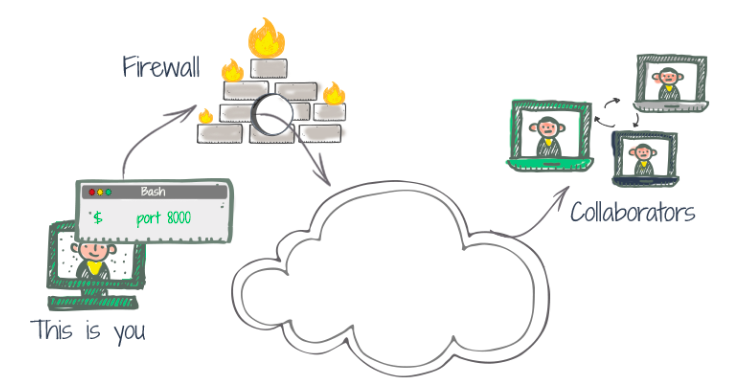
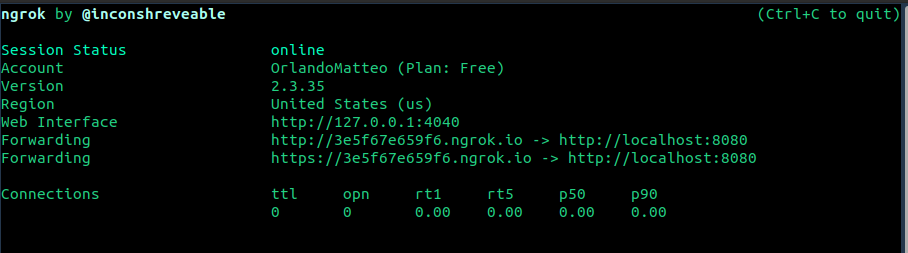

## a.k.a. How to obtain public url


---
# Motivation

In a a lot of cases you would like to give access to an user or an application to a web service that is running on your pc (_localhost_) or vice versa you want to access to a web service that is running on the pc outside your home network. What solves that? **Tunneling!**
How to do that **ngrok**!


---
# Install ngrok

1. Go on [https://ngrok.com/](https://ngrok.com/)
2. Register
3. Follow the instuction listed [here](https://dashboard.ngrok.com/get-started/setup) for the initial setup

---
# Run vanilla ngrok

Let's suppose you've a web service running on localhost at the port 8080, to obtain an public url you just need to open a new terminal and type ```ngrok http 8080``` this will start a tunnelfor that port and will show something like this


---

After doing that, you will be able to see your webservice at the links indicated by _Forwarding_ (in the example https://3e5f67e659f6.ngrok.io) and you will be able to acces to it from any device even outside your home network (try with your smartphone or ask a friend to do that). <b style="color:magenta">Remember that everytime the url is generated randomly!</b>

---


# Configure ngrok 

If we want to do thi often always for the same application we may want to edit our configuration file. You should find the file _ngrok.yml_ here:

Operative system | file location
-----|------
OS X	|/Users/example/.ngrok2/ngrok.yml
Linux	|/home/example/.ngrok2/ngrok.yml
Windows	|C:\Users\example\.ngrok2\ngrok.yml

---

In this file you should have already a line with ``` authtoken:xxxxxxxxxxxxx```. After this line we can add our tunnels that we use frequently like so

``` yml
tunnels:
  my-cool-website:
    proto: http
    addr: 8000
```

after doing that we will able to launch our tunnel from the terminal by typing ```ngrok start <tunnel-name>```. In our example it would be ```ngrok start my-cool-website```python

---

# Obtain the url from python 

In some cases we may need to obtain the url for our web service,in order to do that we can do as follows:
```python
import requests
r= requests.get('http://localhost:4040/api/tunnels/<tunnel-name>')
publicUrl=r.json()["public_url"]
```
For our example it would be
```python
r= requests.get('http://localhost:4040/api/tunnels/my-cool-website')
publicUrl=r.json()["public_url"]
```
---
# Alternatives
There are several alternative to ngrok (free or paid) that you can find [here](https://alternativeto.net/software/ngrok/?license=opensource)
