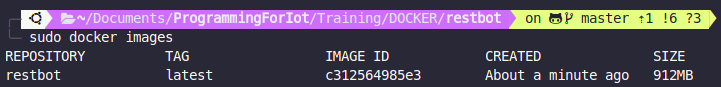

# What is Docker? 
<b style="color:#349ded">Docker</b> is a set of platform as a service (PaaS) products that use OS-level virtualization to deliver software in packages called containers.
Containers are <b style="color:#349ded">isolated</b> from one another and bundle their own software, libraries and configuration files; they can communicate with each other through well-defined channels. 
All containers are run by a single operating system kernel and therefore use fewer resources than virtual machines.

---

## A possible similitude (treat carefully)


---
# Run our first container
## Get the requirements

The first things to do is to obtain the list of the python library needed to run our application. We can do that in a lot of ways, the simplest one is to use [pipreqs](https://pypi.org/project/pipreqs/) and run the command
```pipreqs <absolute path of the script>```
This will create a file called *requirements.txt* in the same folder for example
<div style='font-size:28px'>

```
telepot==12.7
CherryPy==18.6.0
requests==2.22.0
```
</div>

---
# Create the Dockerfile

We need to create **Dockerfile** that is the crucial component needed to run a container with Docker.

```Dockerfile
# set the kernel  to use
FROM python:3
# copy the all the file in the container
COPY . .
# install the needed requirements
RUN pip3 install -r requirements.txt
# the command that will be executed when the container will start
CMD ["python3","./bot.py"]
```
---
# Build the image

To create the image of our application (we can see that as the .exe file) we need to run a simple command
```docker build -t restbot .  ```

After that you can run the command ```docker images``` and  you should see the image we have just built



---

# Binding ports 🚪↔️🚪

Before launching our container we need to clarify some concepts.
When our containers will run we would like to have a way to communicate with  each of them for using the services they provide or even just for debugging. 
In order to do that we will write the ```docker run``` command we will need to specify the so-called <b style='color:orange'>port binding</b> with the parameter ```-p <host port>:<container port>```

---
# Binding ports 🚪↔️🚪


---
# Launch our first container

To run our container we simply need to execute the following command

You should now see the service starting in your terminal. to run it in background you can add the parameter ```-d``` in the command
```sudo docker run --name restBot -p -d 8080:80 restbot```   