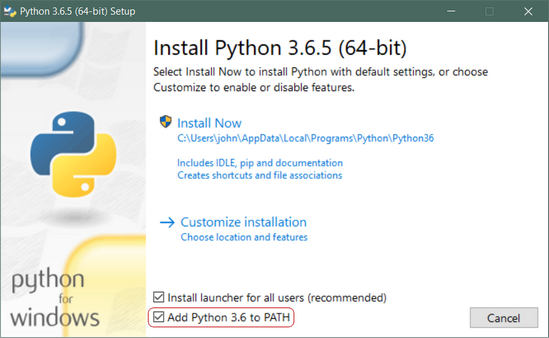

# How to install Python3

---

# For Windows 

- Download the latest Python release installer for your OS  from [here](https://www.python.org/downloads/)
- Launch the installer
- **Pay Attention to select add Python to path**  
 
- Wait until it's done :sweat_smile:

---


# For macOS 

You've two alternatives:  

1. Proceed as indicated with windows (but obviously download the installer for mac)
2. If you've brew installed just open a terminal and write "*brew install python3*"

---
# For Linux

Python3 should be already available on most Linux of distribution, in the rare case you don't have it you can install it by writing on a terminal "*sudo |name of the packet manager| install python3*" (For example in Ubuntu "*sudo apt-get install python3*")

---

# ReadyCheck

In any case to check Python wheter has been correctly installed open a terminal and type "*python3*" you should see something like this

``` bash
matteo@matteo-desktop ~> python3
Python 3.6.8 (default, Aug 20 2019, 17:12:48) 
[GCC 8.3.0] on linux
Type "help", "copyright", "credits" or "license" for more information.
>>>
```

---

# How to install VS Code 


Go on the [VS Code website](https://code.visualstudio.com/) and follow the installation guide for your OS

**Optional**

In the _Extensions_ tab ( on the left side ) search for "python" an install the extension

---