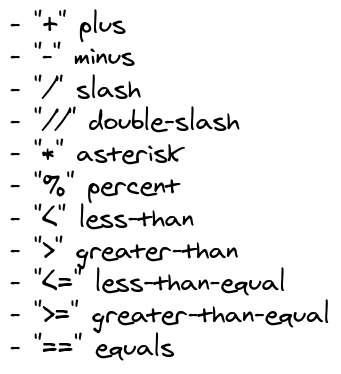

# How to launch a Python script

Launching a Python script is quite easy, these are the steps to follow:  

1. Open a new terminal (Command line for Windows)
2. Navigate to the folder , "_cd name of the folder_" to open a folder , "_dir_" to list the file in the folder ("_ls_" for MacOS and Linux)
3. type "_python |name of the file|.py_"  

For the rest of the course we will always launch our Python scripts in this way

---

# Exercise 0

Before anything you want to define the "main" as you would do in C. In Python we can do this like it's shown below

```python
if __name__=="__main__":
    #This is the main
    pass

```

**Remember that in Python indentation take places of the bracket**, we will see going on with the exercise what this means

---

# Main example

**Print**  
Printing in python is really easy, you've just to type

``` python
print ("what you want to print")
```

An example is shown below

```python
if __name__=="__main__":
    #This is the main
    print ("Sentence to print")
```

---
# Exercise 1


Now try to write and launch your Python script and print some words/sentences, you will see that contrarily to C python will print the content of each _print()_ in a new line

---

# Print with Python

**Print with placeholder**  
In a lot of case you want to print things like  

```bash
the average of the values is: 5.4
```

In general you would like to print a string and the value of a variable or multiple variable. There a lot of way to print in Python, we will see just 2 of them.  

---

# First Method

The first method consists in using placeholder with "%" like you would do in C, there are different type of plceholder, you will mainly use the following:  

 - %s to print string
 - %d to print integer
 - %f to print float
 - %e to print in exponential form

---

# Special cases

In case of floating point number you can specify the number of digits after the comma by writing "_%.**n**f_" where n is the number of digits so for example if we want to have 3 digits we would write "%.3f". This method will work also with "%s" but in that case the number will specify the number of **characters** that will be used (including the "."). If you want to specify multiple variable you will write  

``` python
print(" %s  %d %f" %(a,b,c))
```

---

# Second method

The second method use the letter "f", in this case the placeholder is the same for every type of variable and is "_{variable}_", so the example we saw before would become:  

``` python
print(f"My name is {myname}")
```  

In this case if we want to print multiple variable we would write:  

``` python
print(f"{a} {b} {c}")
```  

---

# Special cases

With this method you can also specify the total number of digits by writing "_{:.**n**}_" where n is the **total** number of digits so if for example we want to write pi with 3 decimal digits we would write  

``` python 
pi=3.15169265
print(f"{pi:.4}").  
```  

---

# Exercise 2

Now try to use both this method to write a Python script that give as output your nam, your age and your birthday in this way:  

``` bash
My name is Python and I'm 28 years old, I was born the 20/02/1991
```

---

# Exercise 3

**Math operators**  
In python we can use a lot of mathematical operators let's check which they are :arrow_right:



---

#


To try to understand what they do let's write a python script with one operation for each of them, something like the one below:

```python
if __name__=="__main__":
    print (f"2+3={2+3}")
```

``` bash
    2+3=5
```

---
# Exercise 4

**Ask user input**  
The function to ask inputs from user in Python is simply "_input()_". For example:  

``` python
number=input(" Please write a number")
```  

That is quite easy so let's try to write a script that ask the user his name and his age and his height and reply somthing like:  

``` Markdown
So you're Mt. Everest you're 60000 years old and you're tall 8848 m...
```

---

# How to work on files

Reading and writing file in Python is really easy, the function you need are the following:

``` python
open()
read()
readline()
write()
close()
```

---

#  Open a file

___open()___  
this function returns an oject of the type file  


``` python
#Open file in reading mode
f=open('myFile.txt')

#Open file in writing mode
f=open('myFile.txt','w')

#Open file in append mode
f=open('myFile.txt','a')
```

---

# Read a file
___read()___  
this function return the whole content  of the file as a string  

``` python

#Open and read the content of the file "myFile.txt"
f=open('myFile.txt')
fileContent=f.read()
```  

---

# Read a line

___readline()___  
this function return one line of the file as a string  

``` python

#Open the file "myFile.txt" and read one line
f=open('myFile.txt')
fileLine=f.readline()
```  

---

# Write a file

___write()___
this function write on a file  

``` python
#Open the file "myFile.txt" and write one line
f=open('myFile.txt','w')
f.write('line to write')
```  

---

# Close a file

___close()___
this function closes the file  

``` python
#Open the file "myFile.txt", write one line and close the file
f=open('myFile.txt','w')
f.write('line to write')
f.close()
```  

---

# Exercise 5

As exercise create 2 file: "original.txt" with some random conten and an empty file called "copy.txt", then write a python script to open the first file, shows its content on the terminal and write the content of "original.txt" in "copy.txt" but add at the beginning "the content of the original file is:". So the result should look like this.  

---

#

_original.txt_  

Lorem ipsum dolor sit amet, consectetur adipiscing elit, sed do eiusmod tempor incididunt ut labore et dolore magna aliqua."  

_copyt.txt_  

"The content of the original file is:  
Lorem ipsum dolor sit amet, consectetur adipiscing elit, sed do eiusmod tempor incididunt ut labore et dolore magna aliqua."

---

# If-elif-else
 
The easiest way to show how _if-elif-else_ works is by making an example. So let's see a script that asks to the user two number and tells if the first is greater, smaller or equal to the second

---

#

```python
if __name__=="__main__":
    #Receive two number as input
    a=int(input('Write a number\n'))
    b=int(input('Write another number\n'))
    #First case a>b
    if a>b:
        print(f"{a} is greater than {b}")
    #Second case a<b
    elif a<b:
        print(f"{a} is smaller than {b}")
    #All the other case
    else:
        print(f"{a} equals {b}")
```

---

# Exercise 6

We can annidate multiple _if-elif-else_ just remember to use the correct indentation, most code editors will do it for you but pay attention to it. You can create complex condition with "and" and "or".  
As exercise write a script that takes as input a number and chech whether it's a multiple of 2 and 3.

---

# List, for-loop, while-loop


As you've seen in the slides in python the "array" type is called "list" and there it has some particular function related to it:  

---

# List functions 1/3

- _list\[i]_  
  Return the i-th element of the list
  
- _list.append(x)_  
  Add an item to the end of the list.

- _list.insert(i, x)_  
  Insert an item at a given position. The first argument is the index of the element before which to insert

---

# List functions 2/3

- _list.remove(x)_  
  Remove the first item from the list whose value is x. It is an error if there is no such item.

- _list.pop([i])_  
  Remove the item at the given position in the list, and return it. If no index is specified, a.pop() removes and returns the last item in the list.

  ---

# List functions 3/3


- _list.index(x)_  
  Return the index in the list of the first item whose value is x. It is an error if there is no such item.

- _list.count(x)_  
  Return the number of times x appears in the list.
  
- _len(list)_  
   Return the number of element in the list  

---

# 


## :warning: Remember that list in python start at 0


---

# How to use the lists?

The easiest way to show how the _for-loop_  and the _while-loop_ works is by making an example. So let's see a script that creates a list with some number and calculates their sum and their product:

---

# For-loop
```python
if __name__=="__main__":
    numbers=[1,2,3,4,5]
    list_len=len(numbers)
    
    ##For-loop for the sum
    #set sum to 0
    sum_of_numbers=0
    for i in range(list_len):
        #takes the previous value of the sum and add the number at the place i
        sum_of_numbers=sum_of_numbers+numbers[i]
        #the more "pythonic" way to do it is
        #sum_of_numbers+=numbers[i]
    print(f"The sum of the numbers in the list is {sum_of_numbers}")
```
---

# While-loop

```python
if __name__=="__main__":
    numbers=[1,2,3,4,5]
    list_len=len(numbers)
    #set counter to 0 an product to 1
    i=0
    product_of_numbers=1
    while i<list_len:
        #Multiply the old value for the number at place i
        product_of_numbers=product_of_numbers*numbers[i]
        #the more "pythonic" way to do it is
        #product_of_numbers*=numbers[i]
        #Update counter
        i=i+1
    print(f"The product of the numbers in the list in {product_of_numbers}")
```

---

# For in the "pythonic" way

There is another method to write the _for-loop_ that is a little easier that is : ``` for item in list:```  

Using this method for the previous example it becomes

```python
if __name__=="__main__":
    numbers=[1,2,3,4,5]
    sum_of_numbers=0
    for item in numbers:
        sum_of_numbers+=item
```

---

# Exercise 7

As exercise write a script to calculate the average, the max and the min of a list of number

---

# Dictionaries

An really useful datatype of python is "dict". Dictionaries are collections of couples of key/value, key are of type string and they are unique for each dict, the value of a dict can be of whatever type :int,float,string,list or even other dict. Let's see an example of dict and what function can be used on a dict.

---

#

```python
if __name__=="__main__":
    config={
    "lastUpdate": "2020-7-25-22:46",
    "devicesList": [
            {
                "deviceID": "BOX1_A_FAN_1",
                "availableResources": "Fan",
                "IP": "192.168.1.254",
                "port": 49160,
                "endPoints": {
                    "REST": "http://192.168.1.254:49160/greenhouse/box_1/actuators/fan",
                    "MQTT": "greenhouse/box_1/actuators/fan"
                },
                "insertTimestamp": 1595709994.0579066
            }
        ]
    }
```

---

# Exercise 8

As exercise write a script that ask as input the data needed to fill the dict defined below and print the dict as output

```python
personal_data={
"projectName":"",
              "company":"",
              "deviceList":[
                    {
                        "deviceID":""
                        "deviceName":""
                        "deviceType":""
                    }
                ]}
```

---

# JSON files

For all te course we will use _.json_ files a json is essentialy a dictionary saved on a file, it is easy for humans to read and write. It is easy for machines to parse and generate. Python has a module (i.e. library) called _json_ that contains all the function we need to read and write json files.
The function we will use are 

---

# json.load(fp)

the output is a dictionary that filled with the content of from te file pointer fp (fp is the result ofthe function open("<name_of_the_file>.json")). What we will usually write is ```dictionaryName=json.load(open("<name_of_the_file>.json"))```

---

# json.dump(d,fp)
this is used to write the dictionary _d_ on the file pointer fp. What we uually write could be ```json.dump(dictionaryName,open("<name_of_the_file>.json","w"))```

---

# json.loads(myString)

this will return a dictionary obtained by converting the string _myString_. We eill use this function later in the course

---

# json.dump(d)  

this will return a string by converting the dictionary _d_. Also this function will be useful later in the course

---

# Exercise 9

As exercise try to save the variable _personal\_data_ from the exercise 8 into a json file

---

# Functions

Functions are usefule to repeat the same operation multiple times without writing the same code multiple times. Let's see an example of a function

```python
def useless_function(argument):
    argument_v2=argument+argument
    return argument_v2
if __name__=="__main__":
    y=useless_function("IoT")
    print(y)
    z=useless_function([1,2,3])
    print(z)
```

---

#  Exercise 10

As we see in this example we don't need to specify the type of the input of the function, python will understand it by itself (by the way this is a special case due to the fact that int,string and list all support the operator "+" in does **not** work) 

As exercise write 4 function to: add, subtract, multiply and divide two given numbers and print the result
