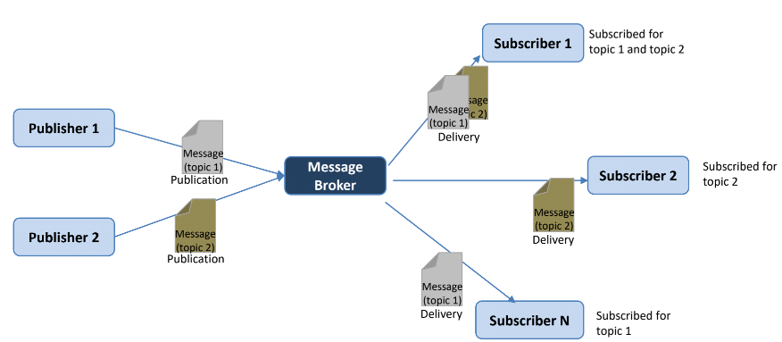
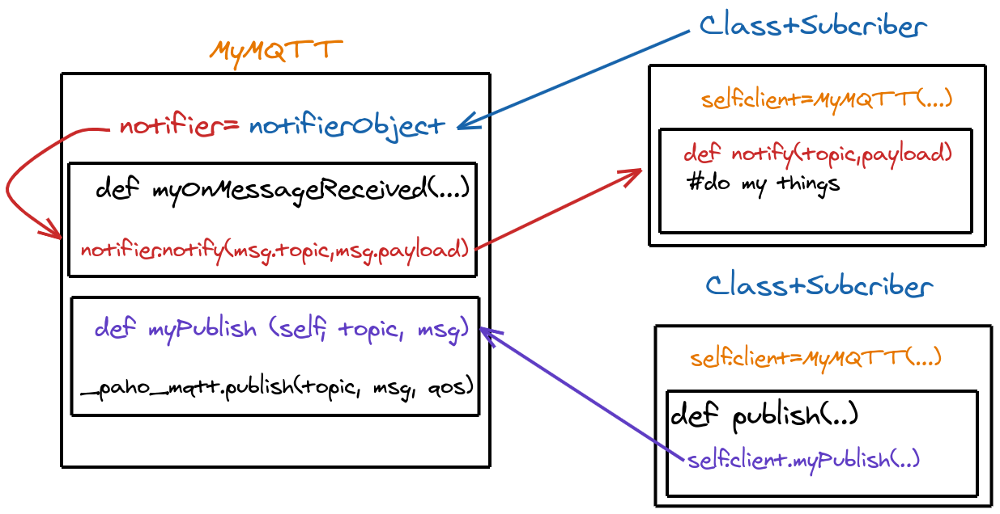
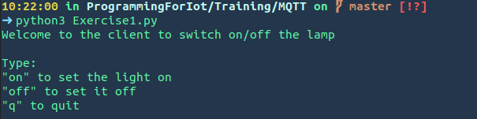

# Introduction



---
We could briefly resume the structure of the MQTT communication paradigm in this way, there are 3 type of actors:***Publisher***,***Subscriber***,***Broker***.  
* The ***Publisher*** is the actor that wants to send messages tagged by a *topic*
* The ***Subsciber*** is the actor that wants to receive messages that belong to variable number of topic. 
* The ***Broker*** is the actor in the middle: it receives the messages from all the publisher and forwards each of them to the suscriber according to the *topic*.
  
Here below you can find the examples for the implementation of a publisher and a subscriber

---
```python
import paho.mqtt.client as PahoMQTT

class MyPublisher:
    def __init__(self, clientID,broker):
        self.clientID = clientID
        # create an instance of paho.mqtt.client
        self._paho_mqtt = PahoMQTT.Client(self.clientID, True) 
        # register the callback
        self._paho_mqtt.on_connect = self.myOnConnect        
        self.messageBroker = broker
 
    def start (self):
        #manage connection to broker
        self._paho_mqtt.connect(self.messageBroker, 1883)
        self._paho_mqtt.loop_start()
 
    def stop (self):
        self._paho_mqtt.loop_stop()
        self._paho_mqtt.disconnect()
    
    def myOnConnect (self, paho_mqtt, userdata, flags, rc):
        print ("Connected to %s with result code: %d" % (self.messageBroker, rc))
 
    def myPublish(self, topic, message):
        # publish a message with a certain topic
        self._paho_mqtt.publish(topic, message, 2)
```

---
```python
class MySubscriber:
        def __init__(self, clientID,topic,broker):
            self.clientID = clientID
            # create an instance of paho.mqtt.client
            self._paho_mqtt = PahoMQTT.Client(clientID, True) 
            # register the callback
            self._paho_mqtt.on_connect = self.myOnConnect
            self._paho_mqtt.on_message = self.myOnMessageReceived
            self.topic = topic
            self.messageBroker = broker
 
        def start (self):
            #manage connection to broker
            self._paho_mqtt.connect(self.messageBroker, 1883)
            self._paho_mqtt.loop_start()
            # subscribe for a topic
            self._paho_mqtt.subscribe(self.topic, 2)
 
        def stop (self):
            self._paho_mqtt.unsubscribe(self.topic)
            self._paho_mqtt.loop_stop()
            self._paho_mqtt.disconnect()
 
        def myOnConnect (self, paho_mqtt, userdata, flags, rc):
            print ("Connected to %s with result code: %d" % (self.messageBroker, rc))
 
        def myOnMessageReceived (self, paho_mqtt , userdata, msg):
            # A new message is received
            print ("Topic:'" + msg.topic+"', QoS: '"+str(msg.qos)+"' Message: '"+str(msg.payload) + "'")
```

---

# General MQTT client: why

Considering the implementations above, everytime we want to add mqtt capabilities to a class we should write everytime the same code to define all the function that an MQTT client needs. We would like to have a smarter way to do that, we would lik to have a **General purpose** MQTT client that we can reuse everytime without the needs to copypaste code.

---


---


# General MQTT client: the idea



---


# General  MQTT client: the code

<div class="colwrap">
<div class="left">

```python
import paho.mqtt.client as PahoMQTT

class MyMQTT:
    def __init__(self, clientID, broker, port, notifier=None):
        self.broker = broker
        self.port = port
        self.notifier = notifier
        self.clientID = clientID
 
        self._topic = ""
        self._isSubscriber = False
 
        # create an instance of paho.mqtt.client
        self._paho_mqtt = PahoMQTT.Client(clientID, False) 
 
        # register the callback
        self._paho_mqtt.on_connect = self.myOnConnect
        self._paho_mqtt.on_message = self.myOnMessageReceived
 
 
    def myOnConnect (self, paho_mqtt, userdata, flags, rc):
        print ("Connected to %s with result code: %d" % (self.broker, rc))

    def myOnMessageReceived (self, paho_mqtt , userdata, msg):
        # A new message is received
        self.notifier.notify (msg.topic, msg.payload)
```
</div>
<div class="right inverted">

``` python
    def myPublish (self, topic, msg):
        # if needed, you can do some computation or error-check before publishing
        print ("publishing '%s' with topic '%s'" % (msg, topic))
        # publish a message with a certain topic
        self._paho_mqtt.publish(topic, json.dumps(msg), 2)
 
    def mySubscribe (self, topic):
        # if needed, you can do some computation or error-check before subscribing
        print ("subscribing to %s" % (topic))
        # subscribe for a topic
        self._paho_mqtt.subscribe(topic, 2)
 
        # just to remember that it works also as a subscriber
        self._isSubscriber = True
        self._topic = topic
 
    def start(self):
        #manage connection to broker
        self._paho_mqtt.connect(self.broker , self.port)
        self._paho_mqtt.loop_start()
 
    def stop (self):
        if (self._isSubscriber):
            # remember to unsuscribe if it is working also as subscriber 
            self._paho_mqtt.unsubscribe(self._topic)
 
        self._paho_mqtt.loop_stop()
        self._paho_mqtt.disconnect()

```
</div>

---

# Exercise 1

Try to create a script that mimics a light that is an MQTT subscriber for the topic **IoT/\<your-name>/led** and it has a status that can be on/off and . Then create a client that uses MQTT to set the status of the light from the terminal. USe the SenML format fro the MQTT payload.




---

# Exercise 2

Try to improve the previous exercise by creating a REST client to set the status of the light. You can use the file *'index.html'* as page for the GET request, when you will click on the button the page will execute a PUT request where the uri indicates the status we want to set (i.e. http://localhost:8080/on)

---

# Exercise 3

For this exercise you've to make a client to follow the data coming from a group of sensors of temperature and humidity tht are on a building of the "IoT_project". The fake data are published from the script _"sensors.py"_, the building has 5 floors (from 0 to 4) with 3 room for each floor and one sensor in each room , for a total of 15 sensors. Each sensor publish the collected data on a topic of this kind:


``` bash
buildingID/floorID/roomID/sensorID
```
---

so for example the sensor on the room 2 of the 3rd floor would publish it on :  

```
IoT_project/2/3/dht_025
```
We want to create a client that give the possibility to choose how what data to retrieve according to three options

 - Data from all the sensors of the building
 - Data from all the sensor on a single floor
 - Data from the sensor in a single room
 
If you feel bold enough you can try to give the user the possibility to change his idea and change what he wants to monitor on the fly


