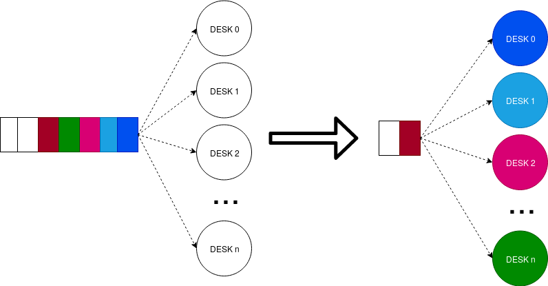
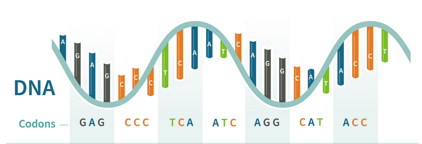
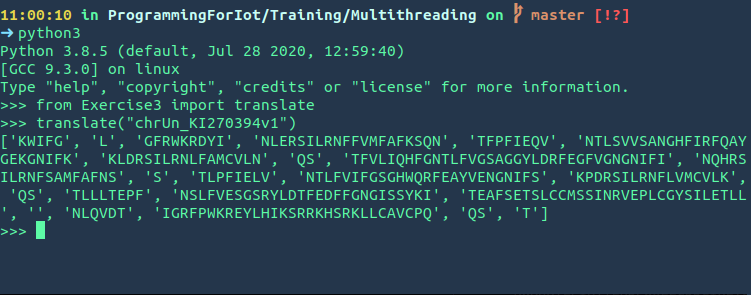

# Multithread in Python

Running several threads is similar to running several different programs concurrently, but with the following benefits −

  *  Multiple threads within a process share the same data space with the main thread and can therefore share information or communicate with each other more easily than if they were separate processes.

  *  Threads sometimes called light-weight processes and they do not require much memory overhead; they are cheaper than processes.

---

# :warning: <span style="color:red">Multithread $\neq$ Multiprocess</span>


---

# Multi-threading in Python 1/2

We can use the multithreading capabilities of Python with the module *threading*. There are also other tools to achieve the same results but we will just use this one.
To create our custom thread class we want to use the code below:
<div style='font-size:30px'>

```python
import threading
class MyThread(threading.Thread):
    def __init__(self, threadID):
        threading.Thread.__init__(self)
        #Setup thread
        self.threadID = threadID
    def run(self):
        pass
        #Do something
```

</div>

---

# Multi-threading in Python 2/2

Inside the init method we will the define the parameters of the thread while inside the run method we will specify the instructions that the trade will execute. To create a thread and start it we can just write:

```python
if __name__=="__main__":
    threadID=1
    thread=MyThread(threadID)
    thread.start()
    #if we want to wait it to finish before proceeding with other instructions we write
    #thread.join()
```
---

# Exercise 1

In this exercise we want to test if we can improve the the speed of a little piece of code by using multi-threading.
We want to execute a GET request to a list of websites in two ways:

   1. using a simple for cycle
   2. using separate threads for each request  
   
We want to measure the execution time of both of the solutions to check which of them is the fastest.

---
```python
#Code to avaluate execution time
import time
#Websites list
website_list= ["http://yahoo.com", 
               "http://google.com",
               "http://amazon.com",
               "http://ibm.com", 
               "http://apple.com",
               "https://www.microsoft.com",
               "https://www.youtube.com/" ,
               "https://www.polito.it/" ,
               "http://www.wikipedia.org",
               "https://www.reddit.com/",
               "https://www.adobe.com/",
               "https://wordpress.org/",
               "https://github.com/",
               "https://www.google.com/maps/"]
start = time.time()
#Code to measure
stop=time.time()
execution_time=stop-start
```
---

# Exercise 2

In this exercise we want to simulate the queue for that we can find in a lot of supermarket nowadays, a single queue that than sends the customer to the first cash desk available.

<div style="text-align:center">


</div>

---

We want to create a list of customers that has their own serve-time that is random number (you can use numpy.random to generate random numbers with particular distributions) and a list of cash desk. 
We want to analyze the result of the simulation so we want to know the total time needed to serve all the customers, the average time for each desk and the number of customer served by each cash desk

<div style='text-align:center;position:center'>

Total time | Average time | Customer per desk
---|---|---
?|?|?|
</div>

---

# Exercise 3

We want to create a script that uses multithreading to convert a dna sequence to the correspondent protein. 

<div style='text-align:center'>


</div>

--- 
A DNA sequence is composed by a concatenation of **nucletides** that can have four possible values :'A', 'T', 'C', 'G'. Each group of 3 nucleotides is called **codon** and which indicicates a particular **aminoacid**. A sequence of **aminoacid** correnspond to a protein. 
<br>
Inside the file _usefulthings.txt_ you can find the dictionary to convert a condon to a aminoacid. 
Inside the file _chromosomes.json_ there is a list of chromosomes. 

---

We want to create a python script that uses multithread that do what follows:

   1. Perform a get request to this api  
   https://api.genome.ucsc.edu/getData/sequence?genome=hg38;chrom=<chromosome name\>
   1. Convert each codon to the corresponding aminoacid
   2. Return the sequence that define the protein
    
Pay attention that some codon in the table correspond to 'STOP', this indicates the finish of the previous protein and the start of a new one.

---

To start do no use all the list of chromosomes but go step by step.

Below you can see an example of the result of the funion that translates the chromosome
<div style='text-align:center'>



</div>
