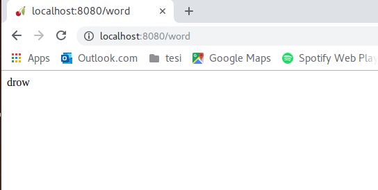
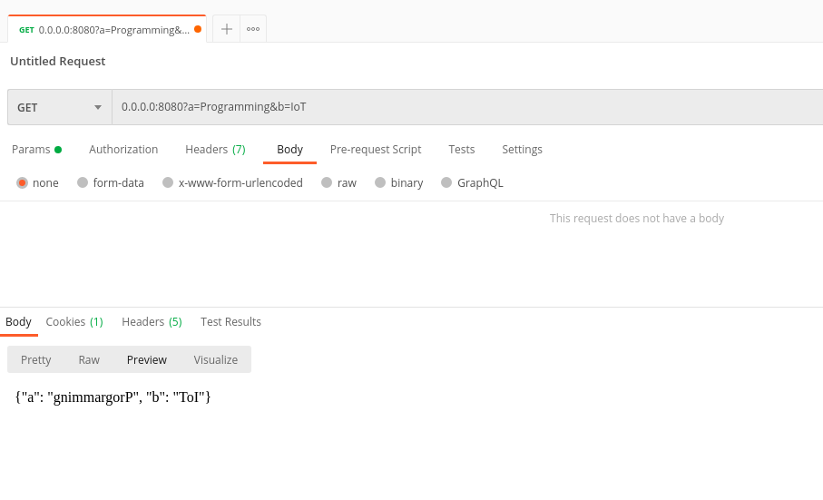

# Web programming with Python

---

# Install and use CherryPy

## Install

To install CherryPy just open a terminal and type "pip3 install cherrypy"

## "Hello World"

Let's create a new file called "helloWorld.py" and paste the following code inside it

---

``` python
import cherrypy

class HelloWorld(object):
    exposed=True
    def GET(self,*uri,**params):
        #Standard output
        output="Hello World"
        #Check the uri in the requests
        #<br> is just used to append the content in a new line 
        #(<br> is the \n for HTML)
        if len(uri)!=0:
            output+='<br>uri: '+','.join(uri)
        #Check the parameters in the request
        #<br> is just used to append the content in a new line 
        #(<br> is the \n for HTML)
        if params!={}:
            output+='<br>params: '+str(params)
        return output

if __name__=="__main__":
    #Standard configuration to serve the url "localhost:8080"
    conf={
        '/':{
                'request.dispatch':cherrypy.dispatch.MethodDispatcher(),
                'tool.session.on':True
        }
    }
    cherrypy.quickstart(HelloWorld(),'/',conf)
```

---

# Exercise 1

We want to create a we services that is able to read the uri we send as GET request and return the string reversed, the result is shown in the slide below.

---



---

## Tips and tricks

Once you've created your class you can use the code below inside the "main" function to configure the server (pay attention to the indentaion!)

```python
if __name__ == '__main__':
    conf={
        '/':{
                'request.dispatch':cherrypy.dispatch.MethodDispatcher(),
                'tool.session.on':True
        }
    cherrypy.tree.mount(MyWebService(),'/',conf)
    cherrypy.engine.start()
    cherrypy.engine.block()
```

---

# Exercise 2

Now let's create a web service similar to the one before but instead we want to pass the string to revert as parameter GET request. In this case the result should be a json that look like the sollowing slide.

---



---
# 

## Tips and tricks

- You can use "Postman" available at this link to perform a PUT request to your service
- When you create the json for the body remember to use double quotes ("") to indicate the keys and the values to avoid errors.

---

# Exercise 3

With this exercise we will try to become familiar with REST APIs.
At [this link](https://github.com/public-apis/public-apis) you can find a list of free API, to make this exercise choose one of them that doesn't not require authentication (Auth=No).
According to the one you choose you've to make a simple client to interact with it and do some basic search (try to find one that provides json as response and not images).

---

To make the request to the url you can use [this](https://requests.readthedocs.io/en/master/) python package that you can install writing _"pip install requests"_ on your terminal, look at the documentation to understand how you can use it.

```python
#Some example about how to use it
import requests
r = requests.get('https://api.github.com/events')
r.text
r.json()
```
---

# Let's make an example.

Let's chose the [exchange-rate api](https://exchangeratesapi.io/) and see how the API looks like
The three main entry point of the API are:

   1. **https://api.exchangeratesapi.io/latest?base=...**  With this we need to specify the base currency to obtain the exchange rate
   2. **https://api.exchangeratesapi.io/YYYY-MM-YY**  To otain the rate of a particular day
   3. **https://api.exchangeratesapi.io/history?start_at=YYYY-MM-YY&end_at=YYYY-MM-YY** To obtain the rates in the specified interval

---

Knowing this we want to create a client that allows 3 function:

   1. Obtain the latest exchange rates by specifying the base currency
   2. Obtain the exchange rates of a specific day
   3. Obtain the rates in an interval of days

The client looks like this:

``` Markdown
Available command:
latest:latest change rate
history: historic exchange rates
quit:exit
```

---

# Use static file for style and interactions (a.k.a. css and js)

Right now all the result we have returned to the user were quite ugly and not interactive at all. To give nicer result to the user and make the page interactive we need to use <b style="color:red;">css</b> files for the style and <b style="color:red;">js</b> for the interactions. Let's see how to do that with cherrypy

---

## The objective 
We would like to obtain the result shown on the right. In that page the user can click on a button and set the color of the top rectangle. 

---

## Check the file needed

``` html
 <head> 
     ...
 	<link rel="stylesheet" type="text/css" href="/css/myButton.css">
     <script type="text/javascript" src="/js/myButton.js"></script>
     ...
 </head> 
```
the tag `<link>` is related to the css files while the tag `<script>` is related to js files.

---

## The folder structure


---

## The class
``` python
import cherrypy
import os

class Example(object):
	"""docstring for Reverser"""
	exposed=True
	def __init__(self):
		self.id=1
	def GET(self):
		return open("index.html")
```

---

## The conf

```python
	conf={
		'/':{
				'request.dispatch':cherrypy.dispatch.MethodDispatcher(),
				'tools.staticdir.root': os.path.abspath(os.getcwd()),
			},
		 '/css':{
		 'tools.staticdir.on': True,
		 'tools.staticdir.dir':'./css'
		 },
		 '/js':{
		 'tools.staticdir.on': True,
		 'tools.staticdir.dir':'./js'
		 },
	}		

```