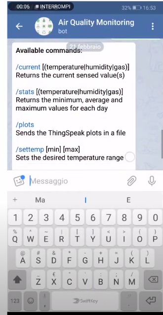

# Telegram bot 

Bots are third-party applications that run inside Telegram. Users can interact with bots by sending them messages, commands and inline requests. You control your bots using HTTPS requests to our Bot API.

[What can be done with bots?](https://core.telegram.org/bots#1-what-can-i-do-with-bots)

---

# Telegram-bot and IoT


For this course telegram-bots will essentially take the place of an app that is usually developed for commercial project.

We will see the basics step to do in order to create a bot, communicate with it and using it to retrieve information and interact with our systems

---

# Requirements

Before starting to code we need two things

* Install the python library called **telepot**
  ```pip install telepot```
* Contact [Botfather](https://telegram.me/BotFather) to obtain a token for our bot

Once we have the token we can save it in a json file but in case of the project we could even store it on the Catalog


---

# Simple echo bot
## Bot initialization

```python
import telepot
from telepot.loop import MessageLoop
import json
import requests

class MyBot:
    def __init__(self):
        # Local token
        self.tokenBot=json.load(open("settings.json"))["telegramToken"]
        # Catalog token
        #self.tokenBot=requests.get("http://catalogIP/telegram_token").json()["telegramToken"]
        self.bot=telepot.Bot(self.tokenBot)
        MessageLoop(self.bot,{'chat': self.on_chat_message}).run_as_thread()
```

---

# Simple echo bot

## on_chat_message callback

```python
    def on_chat_message(self,msg):
        content_type, chat_type ,chat_ID = telepot.glance(msg)
        message=msg['text']

        self.bot.sendMessage(chat_ID,text="You sent:\n"+message)
```